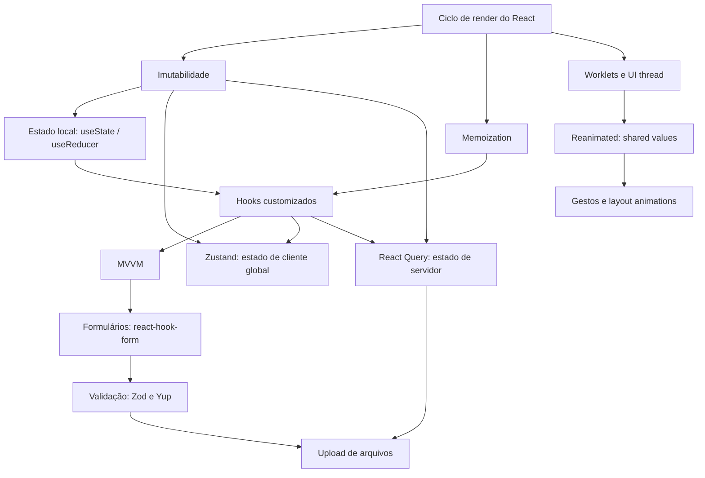

# react-native-mvvm
React Native - Arquitetura MVVM, gestão de estado global com Zustand e de cache de requisições com React Query, Hooks customizados, animações com o React Native Reanimated, upload de arquivos, gestão de estado, validações e imutabilidade.


---
stack: [react-native, expo, typescript, zustand, tanstack-query, reanimated]
tags: [react-native, gestao-de-estado, mvvm, cache, formularios, animacoes]
nivel: intermediário
---

# Arquitetura e Estado em React Native

## Em uma página

Um app React Native é uma função pura que recebe estado e devolve uma árvore de
UI. Todo o resto — arquitetura, bibliotecas, padrões — existe para responder
três perguntas: *onde esse estado mora*, *quem tem o direito de mudá-lo* e
*quem precisa re-renderizar quando ele muda*.

O erro clássico é tratar todo estado como se fosse a mesma coisa. Não é. Existe
**estado de cliente** (o filtro selecionado, o modal aberto, o rascunho do
formulário) — ele nasce e morre no dispositivo, e você é o dono da verdade. E
existe **estado de servidor** (a lista de aeronaves, o saldo de horas) — ele
mora no backend, você só guarda uma *cópia possivelmente desatualizada*. Tentar
gerenciar estado de servidor com ferramenta de estado de cliente é o que produz
aquele `useEffect` com `setLoading(true)`, `try/catch`, flag de `mounted` e um
cache manual que ninguém sabe invalidar.

Este roadmap organiza a separação: **useState/useReducer** para estado local,
**Zustand** para estado de cliente global, **TanStack Query (React Query)** para
estado de servidor com cache, **react-hook-form + Zod/Yup** para o estado
transitório de formulários, e **Reanimated** para o estado de animação — que é
um caso à parte, porque vive fora do React, na thread de UI. Costurando tudo,
**hooks customizados** como unidade de reuso e **MVVM** como disciplina para
manter o componente burro e a lógica testável.

Quando eu vou precisar disso: sempre que uma tela passar de "lista + detalhe" e
começar a ter filtros, sincronização, formulários longos, upload ou qualquer
interação que precise ser fluida a 60fps. É o esqueleto de qualquer app de
produção.

## Mapa do conteúdo



## Checklist de domínio

- [ ] Sei explicar quando o React re-renderiza um componente e o que ele faz com o resultado
- [ ] Sei explicar por que mutar estado não dispara render, e escrever updates imutáveis de objeto, array e estrutura aninhada
- [ ] Sei escolher entre `useState` e `useReducer` e justificar a escolha
- [ ] Sei usar `useMemo`, `useCallback` e `React.memo` sabendo dizer o que cada um custa
- [ ] Sei extrair um hook customizado e definir o contrato que ele expõe
- [ ] Sei aplicar MVVM em React Native, separando View, ViewModel e Model
- [ ] Sei criar uma store Zustand e assinar apenas as fatias que a tela usa
- [ ] Sei usar `persist` e organizar uma store grande em slices
- [ ] Sei explicar `staleTime` vs `gcTime` e o ciclo de vida de uma query
- [ ] Sei escrever mutations com invalidação correta de cache
- [ ] Sei implementar optimistic update com rollback e listagem paginada infinita
- [ ] Sei montar um formulário com react-hook-form em RN usando `Controller`
- [ ] Sei escrever um schema em Zod e o equivalente em Yup, e inferir o tipo a partir dele
- [ ] Sei selecionar um arquivo/imagem e enviá-lo em multipart com progresso e cancelamento
- [ ] Sei explicar o que é um worklet e por que ele roda na UI thread
- [ ] Sei animar com `useSharedValue` + `useAnimatedStyle` e reagir a gestos sem travar a lista

---

## Módulo 1 — Fundamentos de estado

### 1.1 Ciclo de render e reconciliação ⚠️ (não coberto no curso, mas necessário)

**O que é**

Antes do React, atualizar a tela era imperativo: você achava o elemento e
mandava ele mudar (`label.text = "Olá"`). Com dez telas e vinte campos, ninguém
mais sabia quem alterava o quê, e a UI acabava dessincronizada dos dados.

O React inverteu isso. Você escreve uma função que, dado o estado atual,
devolve como a tela *deveria* estar. Quando o estado muda, o React chama a
função de novo, gera uma nova árvore de elementos, compara com a anterior
(reconciliação) e aplica no nativo apenas a diferença.

Um render é só a execução dessa função — é barato e acontece o tempo todo.
O caro é o *commit*: a parte que cruza a ponte e mexe nas views nativas. Um
componente re-renderiza quando (a) seu estado muda, (b) uma prop muda, ou
(c) o pai re-renderizou. O item (c) é o que surpreende: o React não compara
props por padrão, ele simplesmente re-executa o filho.

Isso importa porque todo o resto do roadmap é consequência: imutabilidade
existe para o React *saber* que mudou; memoization existe para cortar o item
(c); selectors do Zustand existem para limitar quem é notificado; e Reanimated
existe para animar *sem* passar por esse ciclo.

**Quando usar / quando não usar**

- Otimizar render é a última coisa a fazer, não a primeira. Meça (Profiler,
  `console.log` no corpo do componente) antes de memoizar.
- Re-render não é bug. 50 re-renders de um componente leve custam menos que uma
  árvore de `useMemo` mal colocada.
- O que realmente dói em RN: re-render de lista longa, re-render que dispara
  layout, e trabalho pesado dentro do corpo do componente.

**Na prática**

```tsx
import { useState } from 'react';
import { Text, Pressable, View } from 'react-native';

function Contador() {
  const [horas, setHoras] = useState(0);

  // Este log roda a CADA render. É o jeito mais barato de enxergar o ciclo.
  console.log('render do Contador');

  return (
    <View>
      <Text>{horas}</Text>
      {/* setHoras agenda um render; não altera "horas" na hora.
          Ler "horas" na linha seguinte ainda devolve o valor antigo. */}
      <Pressable onPress={() => setHoras(horas + 1)}>
        <Text>+1</Text>
      </Pressable>

      {/* Forma funcional: use quando o novo valor depende do anterior.
          Evita perder updates quando dois setState acontecem no mesmo tick. */}
      <Pressable onPress={() => setHoras((h) => h + 1)}>
        <Text>+1 (seguro)</Text>
      </Pressable>
    </View>
  );
}
```

**Exemplo aplicado**

```tsx
// Tela de reservas: o pai re-renderiza a cada tick do relógio,
// e leva TODOS os filhos junto — inclusive a lista, que não depende da hora.
function PainelReservas({ reservas }: { reservas: Reserva[] }) {
  const [agora, setAgora] = useState(new Date());

  useEffect(() => {
    const id = setInterval(() => setAgora(new Date()), 1000);
    return () => clearInterval(id); // cleanup: sem isso, o timer sobrevive à tela
  }, []);

  return (
    <View>
      <Relogio valor={agora} />
      {/* ListaReservas re-renderiza 1x por segundo à toa.
          A correção não é memoizar tudo: é mover o estado do relógio
          para DENTRO de <Relogio />, onde ele é usado. */}
      <ListaReservas dados={reservas} />
    </View>
  );
}
```

**Armadilhas**

- Ler o estado logo após o `setState` esperando o valor novo. O valor só muda no
  próximo render.
- Colocar estado de alta frequência (relógio, scroll, input) no topo da árvore.
  Regra: estado desce até o componente mais baixo que precisa dele.
- `useEffect` sem array de dependências rodando a cada render e chamando
  `setState` — loop infinito.
- Achar que `console.log` fora do JSX não roda. Roda: o corpo do componente *é*
  o render.

**Para lembrar**

> Render é recalcular a descrição da tela. Estado sobe até onde precisa e não
> um nível a mais.

---

### 1.2 Imutabilidade

**O que é**

O React decide se algo mudou comparando referências (`Object.is`), não
conteúdo. Comparar objeto por conteúdo, campo a campo, em toda árvore, a cada
evento, seria caro demais. Então a regra virou: *se mudou, é um objeto novo*.

Daí a consequência que quebra a cabeça de quem vem de C# ou Java: se você fizer
`reserva.status = 'cancelada'` e chamar `setReserva(reserva)`, o React compara a
referência antiga com a nova, vê que são idênticas e **não re-renderiza**. O
dado mudou na memória e a tela ficou mentindo.

Imutabilidade é a disciplina de nunca alterar um valor existente: você produz
uma cópia com a alteração aplicada. `const` não ajuda aqui — `const` congela a
*variável*, não o *objeto*.

O benefício vai além do render. Estado imutável é rastreável (dá para guardar o
valor anterior e comparar), previsível (nenhuma função altera o que você passou
por baixo dos panos) e é pré-requisito para optimistic update, undo e time
travel no DevTools.

**Quando usar / quando não usar**

- Use sempre para qualquer coisa que o React observe: state, props, store
  global, cache de query.
- Custo real: cópias de listas grandes alocam memória. Para 100k itens em loop
  apertado, mutação local dentro de uma função pura (criar o array novo e mutar
  *só* essa cópia local antes de devolvê-la) é aceitável.
- Objeto que nunca entra no ciclo de render (um buffer, um cache interno de
  serviço) não precisa desse cuidado.

**Na prática**

```ts
type Reserva = {
  id: string;
  status: 'confirmada' | 'cancelada';
  passageiros: string[];
  aeronave: { matricula: string; horimetro: number };
};

// ❌ mutação: mesma referência, React não vê mudança
reserva.status = 'cancelada';

// ✅ objeto raso
const cancelada = { ...reserva, status: 'cancelada' as const };

// ✅ array: nunca push/splice/sort direto no estado
const comNovo = [...passageiros, 'Fábio'];
const semUm = passageiros.filter((p) => p !== 'Fábio');
const ordenado = [...passageiros].sort(); // sort MUTA o array original
const trocado = passageiros.map((p) => (p === 'Fábio' ? 'Fabio M.' : p));

// ✅ aninhado: cada nível no caminho da alteração precisa ser copiado.
// Os níveis fora do caminho podem ser reaproveitados por referência.
const atualizada = {
  ...reserva,
  aeronave: { ...reserva.aeronave, horimetro: 1240.5 },
};

// ✅ lista de objetos: copie só o item alterado
const lista = reservas.map((r) =>
  r.id === alvo ? { ...r, status: 'cancelada' as const } : r,
);
```

**Exemplo aplicado**

```ts
// Rateio de horas entre cotistas de uma aeronave.
// Entrada e saída imutáveis: a função nunca altera o que recebeu,
// então dá para comparar antes/depois e mostrar o diff na tela.
type Cotista = { id: string; nome: string; horasUsadas: number };

export function lancarHoras(
  cotistas: Cotista[],
  cotistaId: string,
  horas: number,
): Cotista[] {
  return cotistas.map((c) =>
    c.id === cotistaId ? { ...c, horasUsadas: c.horasUsadas + horas } : c,
  );
}

// Uso na tela: o array anterior continua íntegro para um "desfazer".
const [cotistas, setCotistas] = useState<Cotista[]>(inicial);
const anterior = useRef<Cotista[] | null>(null);

function lancar(id: string, horas: number) {
  anterior.current = cotistas;             // snapshot barato: só a referência
  setCotistas((atual) => lancarHoras(atual, id, horas));
}

function desfazer() {
  if (anterior.current) setCotistas(anterior.current);
}
```

**Armadilhas**

- `sort()`, `reverse()`, `push()`, `splice()` mutam. `map()`, `filter()`,
  `slice()`, `concat()` não. Decorar esses dois grupos evita metade dos bugs.
- Spread é **raso**: `{ ...reserva }` copia o topo, mas `reserva.aeronave`
  continua sendo a *mesma* referência. Mutar ela ainda quebra tudo.
- `JSON.parse(JSON.stringify(x))` como "deep clone" destrói `Date`, `undefined`,
  `Map` e funções. Se precisar mesmo de clone profundo, use `structuredClone`.
- Ordenar direto o array vindo de uma query (`data.sort(...)`) muta o cache do
  React Query. Sempre `[...data].sort(...)`.

**Para lembrar**

> Mutou, o React não viu. Copie o caminho até o campo alterado — e só ele.

---

### 1.3 Estado local: useState e useReducer

**O que é**

`useState` guarda um valor entre renders e devolve a função que o substitui.
Serve para 90% dos casos: um booleano, um texto, um objeto pequeno.

O problema aparece quando o estado tem **regras**. Uma tela de reserva tem
`status`, `carregando`, `erro`, `dadosParciais` — e nem toda combinação é
válida: não existe "carregando + erro" ao mesmo tempo. Com quatro `useState`
soltos, essas regras ficam espalhadas por dez handlers, e mais cedo ou mais
tarde alguém esquece de zerar o erro antes de recarregar.

`useReducer` centraliza isso. Você declara o estado como um objeto único e uma
função pura `(estadoAtual, acao) => novoEstado` que é o único lugar do arquivo
onde a transição acontece. Os handlers passam a apenas *anunciar o que houve*
(`dispatch({ type: 'ENVIO_FALHOU', erro })`), não *como o estado muda*.

Isso é a mesma ideia do Redux, sem a biblioteca — e é a base conceitual do
Zustand, que você vê no Módulo 3.

**Quando usar / quando não usar**

- `useState`: valor independente, transição óbvia, poucos campos.
- `useReducer`: estados que se excluem, próximo valor depende do anterior de
  forma não trivial, ou mais de 3–4 `useState` que sempre mudam juntos.
- Não use `useReducer` só por elegância: ele adiciona indireção. Se o handler
  cabe em uma linha, `useState` ganha.
- Nenhum dos dois para dado que veio do servidor — isso é Módulo 4.

**Na prática**

```tsx
import { useReducer } from 'react';

type Estado =
  | { fase: 'ocioso' }
  | { fase: 'enviando' }
  | { fase: 'erro'; mensagem: string }
  | { fase: 'sucesso'; protocolo: string };

type Acao =
  | { type: 'ENVIAR' }
  | { type: 'FALHOU'; mensagem: string }
  | { type: 'CONCLUIU'; protocolo: string }
  | { type: 'RESETAR' };

// União discriminada: o TypeScript passa a impedir estados impossíveis.
// Não existe "enviando" com "mensagem" de erro — o tipo não permite.
function reducer(estado: Estado, acao: Acao): Estado {
  switch (acao.type) {
    case 'ENVIAR':
      return { fase: 'enviando' };
    case 'FALHOU':
      return { fase: 'erro', mensagem: acao.mensagem };
    case 'CONCLUIU':
      return { fase: 'sucesso', protocolo: acao.protocolo };
    case 'RESETAR':
      return { fase: 'ocioso' };
  }
}

function useEnvio() {
  const [estado, dispatch] = useReducer(reducer, { fase: 'ocioso' });
  return { estado, dispatch };
}
```

**Exemplo aplicado**

```tsx
// Filtros da agenda de voos: campos que mudam juntos e precisam
// resetar a paginação sempre que qualquer um deles muda.
type Filtros = {
  aeronaveId: string | null;
  periodo: 'semana' | 'mes' | 'ano';
  somenteMinhas: boolean;
  pagina: number;
};

type AcaoFiltro =
  | { type: 'AERONAVE'; id: string | null }
  | { type: 'PERIODO'; periodo: Filtros['periodo'] }
  | { type: 'ALTERNAR_MINHAS' }
  | { type: 'PROXIMA_PAGINA' };

function filtrosReducer(estado: Filtros, acao: AcaoFiltro): Filtros {
  switch (acao.type) {
    // A regra "trocar filtro volta para a página 1" mora aqui, em um lugar só.
    case 'AERONAVE':
      return { ...estado, aeronaveId: acao.id, pagina: 1 };
    case 'PERIODO':
      return { ...estado, periodo: acao.periodo, pagina: 1 };
    case 'ALTERNAR_MINHAS':
      return { ...estado, somenteMinhas: !estado.somenteMinhas, pagina: 1 };
    case 'PROXIMA_PAGINA':
      return { ...estado, pagina: estado.pagina + 1 };
  }
}

const INICIAL: Filtros = {
  aeronaveId: null,
  periodo: 'mes',
  somenteMinhas: false,
  pagina: 1,
};

export function useFiltrosAgenda() {
  const [filtros, dispatch] = useReducer(filtrosReducer, INICIAL);
  return { filtros, dispatch };
}
```

**Armadilhas**

- `useState(criarObjetoPesado())` executa a função a **cada** render. Passe a
  função em si: `useState(criarObjetoPesado)` (inicialização preguiçosa).
- Reducer com efeito colateral dentro (fetch, navegação, `Alert`). Reducer é
  função pura: recebe estado e ação, devolve estado. Nada mais.
- Derivar estado de outro estado com `useEffect` + `setState`. Se dá para
  calcular no render (`const total = itens.length`), não guarde em estado.
- Estado duplicado: guardar `aeronaveId` **e** o objeto `aeronave` inteiro.
  Guarde o id; derive o resto.

**Para lembrar**

> Vários `useState` que sempre mudam juntos são um `useReducer` disfarçado.

---

## Módulo 2 — Reuso e arquitetura

### 2.1 Memoization: useMemo, useCallback e memo ⚠️ (não coberto no curso, mas necessário)

**O que é**

Como todo render re-executa o corpo do componente, tudo que está lá dentro é
recriado: objetos, arrays, funções. Duas funções com o mesmo código são
referências diferentes — e isso importa, porque props e dependências são
comparadas por referência.

`useMemo` guarda o **resultado** de um cálculo entre renders. `useCallback`
guarda a **função** em si. `React.memo` envolve um componente e diz: "se as
props forem as mesmas por referência, não re-renderize".

Os três só fazem sentido juntos. Memoizar uma função com `useCallback` sem que
o filho seja `memo` não economiza nada — o filho re-renderiza de qualquer jeito.
Esse é o erro mais comum: código cheio de `useCallback` que só adiciona custo.

Onde memoization deixa de ser opcional: (1) `renderItem` e `keyExtractor` de
`FlatList`/`FlashList`, (2) o `value` de um Context Provider, (3) dependências
de `useEffect` que são objetos, (4) props de componentes que fazem trabalho
pesado ao renderizar.

**Quando usar / quando não usar**

- Use quando a referência estável for **necessária** (dependência de hook, prop
  de componente memoizado) ou quando o cálculo for realmente caro.
- Não use por reflexo: `useMemo` tem custo de memória e de comparação de
  dependências, e polui a leitura.
- Não memoize valores primitivos: número e string já comparam por valor.
- Custo escondido: cada `useCallback` mantém viva a closure inteira, com tudo
  que ela captura.

**Na prática**

```tsx
import { memo, useCallback, useMemo, useState } from 'react';
import { FlatList, Text, Pressable } from 'react-native';

type Item = { id: string; matricula: string };

// memo compara props por referência. Sem ele, o useCallback abaixo é inútil.
const Linha = memo(function Linha({
  item,
  onSelect,
}: {
  item: Item;
  onSelect: (id: string) => void;
}) {
  return (
    <Pressable onPress={() => onSelect(item.id)}>
      <Text>{item.matricula}</Text>
    </Pressable>
  );
});

function Lista({ itens }: { itens: Item[] }) {
  const [busca, setBusca] = useState('');

  // Recalcula só quando itens ou busca mudam — não a cada tecla de outro campo.
  const filtrados = useMemo(
    () => itens.filter((i) => i.matricula.includes(busca.toUpperCase())),
    [itens, busca],
  );

  // Referência estável: sem isso, TODA linha re-renderiza a cada render do pai.
  const selecionar = useCallback((id: string) => {
    console.log('selecionou', id);
  }, []); // sem dependências => a função nunca muda

  const renderItem = useCallback(
    ({ item }: { item: Item }) => <Linha item={item} onSelect={selecionar} />,
    [selecionar],
  );

  return (
    <FlatList
      data={filtrados}
      renderItem={renderItem}
      keyExtractor={(i) => i.id}
    />
  );
}
```

**Exemplo aplicado**

```tsx
// Cabeçalho de relatório de horas: o cálculo percorre 12 meses x N voos.
// Sem useMemo, ele roda de novo a cada caractere digitado no campo de busca.
function ResumoAnual({ voos, ano }: { voos: Voo[]; ano: number }) {
  const [busca, setBusca] = useState('');

  const totaisPorMes = useMemo(() => {
    const acc = new Array(12).fill(0);
    for (const voo of voos) {
      const d = new Date(voo.decolagem);
      if (d.getFullYear() === ano) acc[d.getMonth()] += voo.horas;
    }
    return acc;
  }, [voos, ano]); // "busca" NÃO entra: o cálculo não depende dela

  return <Grafico dados={totaisPorMes} />;
}
```

**Armadilhas**

- `useCallback` sem `memo` no filho: custo sem benefício.
- Dependência faltando no array: você congela um valor antigo e ganha um bug
  silencioso de dado velho. Ligue a regra `react-hooks/exhaustive-deps` do
  ESLint e só a desligue com comentário justificando.
- `<Provider value={{ user, logout }}>` cria um objeto novo por render e
  invalida todo consumidor do Context. Memoize o `value`.
- Passar array/objeto literal como prop de componente memoizado
  (`<X opcoes={[]} />`) anula o `memo`.

**Para lembrar**

> Memoize por causa de uma referência que precisa ser estável — não por
> ansiedade de performance.

---

### 2.2 Hooks customizados

**O que é**

Antes dos hooks, compartilhar lógica com estado entre componentes exigia HOC ou
render props: camadas de componentes que só existiam para carregar
comportamento, deixando a árvore ilegível ("wrapper hell").

Um hook customizado é apenas uma função que começa com `use` e chama outros
hooks. Não tem mágica: quando você chama `useReservas()` dentro de um
componente, os `useState` de dentro dele pertencem àquele componente, como se
você tivesse escrito ali. Duas telas chamando o mesmo hook têm estados
**independentes** — hook compartilha *lógica*, não *estado*. Compartilhar
estado é trabalho de store (Módulo 3) ou de cache (Módulo 4).

O valor real não é evitar repetição de código: é **nomear um comportamento**.
`useUploadDocumento()` diz o que acontece; trinta linhas de `useState` +
`useEffect` no meio da tela, não.

**Quando usar / quando não usar**

- Use quando a mesma sequência de estado/efeito aparece em duas telas, ou
  quando um componente tem mais lógica do que JSX.
- Use para encapsular integração com API imperativa (permissões, câmera,
  `AppState`, teclado, updates OTA).
- Não crie hook para embrulhar uma única chamada sem estado — isso é uma função
  comum, e função comum é mais fácil de testar.
- Evite o hook "faz-tudo" com 12 retornos. Prefira dois hooks focados.

**Na prática**

```ts
import { useEffect, useRef, useState } from 'react';
import { AppState, type AppStateStatus } from 'react-native';

// Contrato: devolve true quando o app está em primeiro plano.
export function useAppAtivo(): boolean {
  const [ativo, setAtivo] = useState(AppState.currentState === 'active');

  useEffect(() => {
    const sub = AppState.addEventListener('change', (estado: AppStateStatus) => {
      setAtivo(estado === 'active');
    });
    // Cleanup é obrigatório: sem remover, o listener continua vivo
    // depois que a tela sai e passa a chamar setState em componente morto.
    return () => sub.remove();
  }, []);

  return ativo;
}

// Hook com valor de retorno estável (tupla nomeada), fácil de consumir:
export function useToggle(inicial = false) {
  const [aberto, setAberto] = useState(inicial);
  const alternar = useRef(() => setAberto((v) => !v)).current;
  return { aberto, alternar, abrir: () => setAberto(true), fechar: () => setAberto(false) };
}
```

**Exemplo aplicado**

```ts
// Sincronização manual de update OTA (Expo/EAS) — comportamento que várias
// telas precisam expor num botão "Atualizar agora".
import { useState, useCallback } from 'react';
import * as Updates from 'expo-updates';

type Status = 'ocioso' | 'verificando' | 'baixando' | 'sem-update' | 'erro';

export function useSincronizarApp() {
  const [status, setStatus] = useState<Status>('ocioso');

  const sincronizar = useCallback(async () => {
    // Em desenvolvimento a API lança erro: não faz sentido tentar.
    if (__DEV__) return;

    try {
      setStatus('verificando');
      const check = await Updates.checkForUpdateAsync();

      if (!check.isAvailable) {
        setStatus('sem-update');
        return;
      }

      setStatus('baixando');
      await Updates.fetchUpdateAsync();
      // reloadAsync reinicia o bundle: nada depois desta linha executa.
      await Updates.reloadAsync();
    } catch {
      setStatus('erro');
    }
  }, []);

  return { status, sincronizar };
}
```

**Armadilhas**

- Chamar hook dentro de `if`, loop ou callback. A ordem das chamadas é a
  identidade de cada hook — ela precisa ser idêntica em todo render.
- Devolver objeto novo a cada render e usá-lo como dependência de `useEffect` no
  consumidor: efeito em loop. Memoize o retorno se ele for para um array de deps.
- Esperar que dois componentes que usam o mesmo hook vejam o mesmo estado.
- Hook que "sabe" da tela (chama `navigation.navigate` internamente). Devolva o
  resultado e deixe a tela decidir; senão o hook não é reutilizável nem testável.

**Para lembrar**

> Hook customizado compartilha comportamento, nunca estado. Cada chamada tem a
> sua própria cópia.

---

### 2.3 Arquitetura MVVM em React Native

**O que é**

Sem disciplina, um componente de tela vira um depósito: fetch, validação,
formatação, navegação, regra de negócio e JSX no mesmo arquivo de 600 linhas.
Testar exige renderizar; reaproveitar em outra tela é impossível; e qualquer
mudança visual arrisca quebrar regra de negócio.

MVVM separa três responsabilidades:

- **Model** — os dados e as regras que não dependem de tela: tipos de domínio,
  serviços de API, funções puras de cálculo. Não importa nada de React.
- **ViewModel** — o estado da tela e as ações que ela pode disparar. Em React
  Native, a ViewModel é *um hook customizado*. Ela conhece o Model, mas não
  conhece componente nem estilo.
- **View** — o componente. Chama a ViewModel, recebe valores prontos e renderiza.
  Idealmente sem `if` de regra de negócio, só de apresentação.

O teste do desenho está certo: se dá para trocar a View inteira (de FlatList
para SectionList, de RN para MAUI) sem tocar na ViewModel, a separação existe.

**Quando usar / quando não usar**

- Use em telas com regra de negócio, múltiplas fontes de dados ou fluxo em
  etapas — e como padrão de time, porque a previsibilidade vale mais que o
  ganho pontual.
- Não use em componente de apresentação puro (um `Badge`, um `Card`): criar
  `useBadgeViewModel` é cerimônia sem retorno.
- Custo: mais arquivos e um salto a mais para ler o fluxo. Em app pequeno isso
  pesa mais que ajuda.

**Na prática**

```
src/
  domain/                      # Model
    aeronave.ts                # tipos + regras puras
  services/
    aeronaves.service.ts       # chamadas HTTP, sem React
  screens/
    Aeronaves/
      useAeronavesViewModel.ts # ViewModel (hook)
      AeronavesScreen.tsx      # View
```

```ts
// domain/aeronave.ts — Model: tipos e regra pura, testável sem React
export type Aeronave = {
  id: string;
  matricula: string;
  horimetro: number;
  proximaInspecaoHoras: number;
};

export function horasAteInspecao(a: Aeronave): number {
  return Math.max(0, a.proximaInspecaoHoras - a.horimetro);
}

export function situacao(a: Aeronave): 'ok' | 'atencao' | 'bloqueada' {
  const restante = horasAteInspecao(a);
  if (restante === 0) return 'bloqueada';
  if (restante <= 10) return 'atencao';
  return 'ok';
}
```

**Exemplo aplicado**

```ts
// screens/Aeronaves/useAeronavesViewModel.ts — ViewModel
import { useMemo, useState } from 'react';
import { useQuery } from '@tanstack/react-query';
import { listarAeronaves } from '../../services/aeronaves.service';
import { situacao, horasAteInspecao } from '../../domain/aeronave';

export function useAeronavesViewModel() {
  const [busca, setBusca] = useState('');
  const { data, isPending, isError, refetch, isRefetching } = useQuery({
    queryKey: ['aeronaves'],
    queryFn: listarAeronaves,
  });

  // A View recebe o dado já no formato de exibição.
  // Nenhum cálculo de domínio sobra para o JSX.
  const itens = useMemo(() => {
    const lista = data ?? [];
    return lista
      .filter((a) => a.matricula.includes(busca.toUpperCase()))
      .map((a) => ({
        id: a.id,
        matricula: a.matricula,
        situacao: situacao(a),
        rodape: `${horasAteInspecao(a).toFixed(1)} h até a inspeção`,
      }));
  }, [data, busca]);

  return {
    itens,
    busca,
    setBusca,
    carregando: isPending,
    erro: isError,
    atualizar: refetch,
    atualizando: isRefetching,
  };
}
```

```tsx
// screens/Aeronaves/AeronavesScreen.tsx — View
import { FlatList, TextInput, Text, View } from 'react-native';
import { useAeronavesViewModel } from './useAeronavesViewModel';

export function AeronavesScreen() {
  const vm = useAeronavesViewModel();

  if (vm.carregando) return <Text>Carregando…</Text>;
  if (vm.erro) return <Text>Não foi possível carregar.</Text>;

  return (
    <View>
      <TextInput value={vm.busca} onChangeText={vm.setBusca} placeholder="Matrícula" />
      <FlatList
        data={vm.itens}
        keyExtractor={(i) => i.id}
        refreshing={vm.atualizando}
        onRefresh={vm.atualizar}
        // A View só decide cor: a classificação veio pronta da ViewModel.
        renderItem={({ item }) => (
          <View>
            <Text>{item.matricula}</Text>
            <Text style={{ color: item.situacao === 'ok' ? '#1b7f3b' : '#b23b1e' }}>
              {item.rodape}
            </Text>
          </View>
        )}
      />
    </View>
  );
}
```

**Armadilhas**

- ViewModel importando componente, `StyleSheet` ou `Alert`. Se importa UI, é
  View disfarçada.
- Devolver o dado cru e deixar formatação/regra no JSX — a separação vira
  fachada.
- Criar uma camada "Repository" que só repassa `fetch`. Indireção sem regra é
  custo puro.
- Confundir MVVM com "um arquivo por camada em toda tela". O critério é a
  responsabilidade, não a contagem de arquivos.

**Para lembrar**

> Em React Native, a ViewModel é um hook. Se ele importa componente, você
> escreveu View com outro nome.

---

## Módulo 3 — Estado de cliente global com Zustand

### 3.1 Store, selectors e assinatura

**O que é**

Estado que várias telas precisam (usuário logado, tema, aeronave selecionada)
não cabe em `useState` local. A solução padrão do React é Context — mas Context
não tem seleção: **todo** consumidor re-renderiza quando qualquer campo do
`value` muda. Um Context com usuário + tema + carrinho re-renderiza a árvore
inteira quando o tema muda. Redux resolvia isso, ao custo de actions, reducers,
tipos e boilerplate.

Zustand é uma store fora do React com um hook para assinar pedaços dela.
`create` recebe uma função que recebe `set` e `get` e devolve o estado inicial
mais as ações. O resultado é um hook: `useStore(seletor)`. O seletor é o ponto
central — ele define **exatamente** o que aquele componente observa. Se a fatia
selecionada não mudou (comparação por `Object.is`), não há re-render, mesmo que
o resto da store tenha mudado.

E como a store vive fora do React, dá para ler e escrever nela em qualquer
lugar: interceptor do Axios, listener de notificação, serviço. Basta
`useStore.getState()` / `useStore.setState()`.

**Quando usar / quando não usar**

- Use para estado de **cliente**: sessão, preferências, tema, filtros
  compartilhados, estado de wizard entre telas.
- Não use para dado de servidor. Guardar a lista de aeronaves numa store
  significa reimplementar cache, revalidação e invalidação na mão — é o
  Módulo 4 que resolve isso.
- Não use para estado que só uma tela usa. Store global é acoplamento.
- Custo: estado global é o mais fácil de crescer sem controle. Cada campo novo
  é uma dependência a mais entre telas que não deveriam se conhecer.

**Na prática**

```ts
// store/sessao.store.ts
import { create } from 'zustand';

type Usuario = { id: string; nome: string; cotas: string[] };

type SessaoState = {
  usuario: Usuario | null;
  token: string | null;
  autenticado: boolean;
  entrar: (usuario: Usuario, token: string) => void;
  sair: () => void;
};

export const useSessaoStore = create<SessaoState>((set) => ({
  usuario: null,
  token: null,
  autenticado: false,

  // "set" faz merge raso do objeto devolvido com o estado atual.
  entrar: (usuario, token) => set({ usuario, token, autenticado: true }),

  // Forma funcional quando o novo valor depende do anterior.
  sair: () => set(() => ({ usuario: null, token: null, autenticado: false })),
}));
```

```tsx
import { useShallow } from 'zustand/react/shallow';

// ❌ assina a store inteira: re-renderiza a qualquer mudança
const store = useSessaoStore();

// ✅ assina um campo: re-renderiza só quando "nome" muda
const nome = useSessaoStore((s) => s.usuario?.nome);

// ✅ ações não mudam de referência: podem ser selecionadas isoladamente
const sair = useSessaoStore((s) => s.sair);

// ⚠️ selecionar um OBJETO cria referência nova a cada render => re-render sempre.
// useShallow compara campo a campo e corta isso.
const { nome: n, cotas } = useSessaoStore(
  useShallow((s) => ({ nome: s.usuario?.nome, cotas: s.usuario?.cotas })),
);
```

**Exemplo aplicado**

```ts
// Uso fora de componente: injetar o token no cliente HTTP.
// Nenhum hook envolvido — a store é apenas um objeto observável.
import axios from 'axios';
import { useSessaoStore } from '../store/sessao.store';

export const api = axios.create({ baseURL: 'https://api.exemplo.com' });

api.interceptors.request.use((config) => {
  const token = useSessaoStore.getState().token;
  if (token) config.headers.Authorization = `Bearer ${token}`;
  return config;
});

api.interceptors.response.use(
  (r) => r,
  (erro) => {
    // 401 derruba a sessão de qualquer lugar do app, sem prop drilling.
    if (erro.response?.status === 401) useSessaoStore.getState().sair();
    return Promise.reject(erro);
  },
);
```

**Armadilhas**

- `const { a, b } = useStore()` sem seletor: assina tudo. É o erro nº 1.
- Seletor que devolve objeto ou array literal sem `useShallow`: referência nova
  a cada render, re-render infinitamente frequente.
- Seletor que **calcula** (`s.itens.filter(...)`): roda a cada mudança da store e
  devolve array novo. Selecione o cru e derive com `useMemo` no componente.
- Guardar em store algo derivável do estado existente. Derive, não duplique.
- Chamar `useStore.getState()` dentro do render para "evitar re-render": você
  perde a reatividade e a tela congela com valor velho.

**Para lembrar**

> A store é global; a assinatura é local. O seletor é o contrato entre as duas.

---

### 3.2 Middlewares: persist, slices e devtools

**O que é**

`create` aceita middlewares que envolvem a store e acrescentam comportamento
sem alterar a lógica. Os que importam no dia a dia:

- **`persist`** — grava a store em armazenamento e reidrata na abertura do app.
  Em React Native o storage precisa ser informado (`AsyncStorage` ou MMKV), e a
  reidratação é **assíncrona**: existe um instante em que o app já renderizou e
  a store ainda está vazia. Ignorar isso produz aquele flash da tela de login em
  usuário já autenticado.
- **`partialize`** — escolhe o que persiste. Nunca persista tudo: estado
  transitório (loading, modal) volta zumbi na próxima abertura.
- **Slices** — para stores grandes: cada slice é uma função que devolve um
  pedaço do estado, e a store final é a composição. Continua sendo uma store só,
  mas cada arquivo cuida de um assunto.

**Quando usar / quando não usar**

- `persist` para sessão, tema, onboarding concluído, rascunhos.
- Nunca persista token de acesso em `AsyncStorage` em app com requisito de
  segurança: `AsyncStorage` é texto plano. Use `expo-secure-store` para
  segredos e deixe o resto no storage comum.
- Slices a partir de ~3 assuntos distintos na mesma store; abaixo disso é
  cerimônia.

**Na prática**

```ts
import { create } from 'zustand';
import { persist, createJSONStorage } from 'zustand/middleware';
import AsyncStorage from '@react-native-async-storage/async-storage';

type PreferenciasState = {
  tema: 'claro' | 'escuro' | 'sistema';
  aeronavePadraoId: string | null;
  onboardingConcluido: boolean;
  _hidratado: boolean;
  setTema: (t: PreferenciasState['tema']) => void;
  concluirOnboarding: () => void;
};

// create<T>()(...) — a chamada curried é exigida pelo TypeScript
// quando há middleware. Sem ela, a inferência de tipos quebra.
export const usePreferenciasStore = create<PreferenciasState>()(
  persist(
    (set) => ({
      tema: 'sistema',
      aeronavePadraoId: null,
      onboardingConcluido: false,
      _hidratado: false,
      setTema: (tema) => set({ tema }),
      concluirOnboarding: () => set({ onboardingConcluido: true }),
    }),
    {
      name: 'preferencias',
      storage: createJSONStorage(() => AsyncStorage),
      // Só estes campos vão para o disco.
      partialize: (s) => ({
        tema: s.tema,
        aeronavePadraoId: s.aeronavePadraoId,
        onboardingConcluido: s.onboardingConcluido,
      }),
      // Chamado quando a leitura do storage termina.
      onRehydrateStorage: () => (state) => {
        state?.set?.({ _hidratado: true } as never);
      },
      // Migração: sem isso, um usuário com dado antigo no disco
      // reidrata um formato que o código atual não entende mais.
      version: 2,
      migrate: (persistido: any, versao) => {
        if (versao < 2) return { ...persistido, aeronavePadraoId: null };
        return persistido;
      },
    },
  ),
);
```

**Exemplo aplicado**

```tsx
// Splash controlada pela reidratação: evita o flash de tela de login.
import { usePreferenciasStore } from './store/preferencias.store';

export function Raiz() {
  const hidratado = usePreferenciasStore((s) => s._hidratado);
  const autenticado = useSessaoStore((s) => s.autenticado);

  // Enquanto o storage não respondeu, não dá para decidir a rota.
  if (!hidratado) return <Splash />;

  return autenticado ? <AppRoutes /> : <AuthRoutes />;
}
```

```ts
// Composição por slices, para store grande.
import { create, type StateCreator } from 'zustand';

type FiltroSlice = { periodo: 'mes' | 'ano'; setPeriodo: (p: 'mes' | 'ano') => void };
type UiSlice = { menuAberto: boolean; alternarMenu: () => void };
type AppStore = FiltroSlice & UiSlice;

const criarFiltroSlice: StateCreator<AppStore, [], [], FiltroSlice> = (set) => ({
  periodo: 'mes',
  setPeriodo: (periodo) => set({ periodo }),
});

const criarUiSlice: StateCreator<AppStore, [], [], UiSlice> = (set) => ({
  menuAberto: false,
  alternarMenu: () => set((s) => ({ menuAberto: !s.menuAberto })),
});

export const useAppStore = create<AppStore>()((...a) => ({
  ...criarFiltroSlice(...a),
  ...criarUiSlice(...a),
}));
```

**Armadilhas**

- Ler a store no primeiro render e assumir que já reidratou. Sempre existe uma
  janela assíncrona.
- Persistir sem `version`/`migrate`: na primeira mudança de formato, usuários
  antigos abrem o app com estado inválido — e o bug não reproduz na sua máquina,
  porque você instalou limpo.
- Persistir funções ou `Date`. O storage é JSON: `Date` volta como string.
- MMKV é bem mais rápido que `AsyncStorage`, mas é síncrono e exige adaptador
  próprio para o `persist`. Escolha consciente, não por hábito.

**Para lembrar**

> Persistir é fácil; reidratar é o que quebra. Trate o "ainda não hidratado"
> como um estado explícito da UI.

---

## Módulo 4 — Estado de servidor com React Query

### 4.1 useQuery e o ciclo de vida do cache

**O que é**

Dado de servidor tem uma propriedade que dado local não tem: ele pode ficar
**velho sem avisar**. Outro usuário confirma uma reserva, e sua cópia local não
sabe. Isso muda tudo — cache, revalidação, deduplicação e retry deixam de ser
detalhe e viram o problema principal.

O padrão manual (`useEffect` + `useState` + `try/catch`) reimplementa isso mal
em toda tela: duas telas montadas fazem duas requisições iguais, voltar da tela
de detalhe refaz tudo do zero, e não existe nenhum lugar onde a resposta fique
guardada.

React Query é um cache indexado por **query key**. `useQuery({ queryKey,
queryFn })` diz: "esta tela precisa deste dado, identificado por esta chave".
A biblioteca decide se serve do cache, se busca, se dedupe com uma requisição
em voo ou se revalida em segundo plano.

Os dois tempos que resolvem 90% das dúvidas:

- **`staleTime`** (padrão `0`) — por quanto tempo o dado é considerado *fresco*.
  Fresco = ninguém busca de novo. Vencido = ainda é exibido, mas dispara
  revalidação no próximo gatilho (montagem, foco, reconexão).
- **`gcTime`** (padrão 5 min) — quanto tempo o dado sobrevive no cache **depois**
  que nenhum componente o usa. Vencido, é descartado da memória.

Ou seja: `staleTime` responde "posso confiar?", `gcTime` responde "posso jogar
fora?". Confundir os dois é o erro conceitual mais comum da biblioteca.

**Quando usar / quando não usar**

- Use para tudo que vem de API: listas, detalhes, agregados, até dados
  "estáticos" que raramente mudam (com `staleTime` alto).
- Não use para estado de cliente. Guardar `menuAberto` no cache de query é
  abuso de ferramenta.
- Em React Native, `refetchOnWindowFocus` não funciona sozinho: não existe
  janela. É preciso ligar o `focusManager` ao `AppState` (veja abaixo).

**Na prática**

```tsx
// app/_layout.tsx — configuração única
import { QueryClient, QueryClientProvider, focusManager, onlineManager } from '@tanstack/react-query';
import { AppState, Platform } from 'react-native';
import NetInfo from '@react-native-community/netinfo';
import { useEffect } from 'react';

const queryClient = new QueryClient({
  defaultOptions: {
    queries: {
      staleTime: 1000 * 60,   // 1 min fresco: evita refetch a cada navegação
      gcTime: 1000 * 60 * 10, // 10 min em memória após ninguém usar
      retry: 2,
    },
  },
});

// Sem isto, o React Query acha que o app está sempre online e nunca focado.
onlineManager.setEventListener((setOnline) =>
  NetInfo.addEventListener((state) => setOnline(!!state.isConnected)),
);

export default function Layout() {
  useEffect(() => {
    const sub = AppState.addEventListener('change', (status) => {
      if (Platform.OS !== 'web') focusManager.setFocused(status === 'active');
    });
    return () => sub.remove();
  }, []);

  return <QueryClientProvider client={queryClient}>{/* rotas */}</QueryClientProvider>;
}
```

```ts
// Query keys centralizadas: chave errada = cache que nunca invalida.
export const chaves = {
  aeronaves: ['aeronaves'] as const,
  aeronave: (id: string) => ['aeronaves', id] as const,
  reservas: (filtros: { aeronaveId?: string; mes: string }) =>
    ['reservas', filtros] as const,
};
```

```tsx
import { useQuery } from '@tanstack/react-query';

function Detalhe({ id }: { id: string }) {
  const { data, isPending, isFetching, isError, error } = useQuery({
    queryKey: chaves.aeronave(id),
    queryFn: ({ signal }) => buscarAeronave(id, signal), // signal cancela ao desmontar
    // enabled controla execução condicional sem quebrar a regra dos hooks
    enabled: Boolean(id),
    staleTime: 1000 * 30,
  });

  // isPending: nunca teve dado. isFetching: está buscando AGORA (inclusive
  // revalidação silenciosa com dado antigo já na tela).
  if (isPending) return <Text>Carregando…</Text>;
  if (isError) return <Text>{(error as Error).message}</Text>;

  return <Ficha aeronave={data} atualizando={isFetching} />;
}
```

**Exemplo aplicado**

```ts
// Lista paginada de reservas com filtro. A chave inclui os filtros,
// então cada combinação tem seu próprio cache — trocar o filtro e voltar
// mostra o resultado anterior instantaneamente.
import { useQuery, keepPreviousData } from '@tanstack/react-query';

export function useReservas(filtros: { aeronaveId?: string; mes: string }) {
  return useQuery({
    queryKey: chaves.reservas(filtros),
    queryFn: () => listarReservas(filtros),
    // Mantém a página anterior visível durante a busca da nova:
    // sem isto, a lista pisca em branco a cada troca de filtro.
    placeholderData: keepPreviousData,
    staleTime: 1000 * 60 * 2,
  });
}
```

**Armadilhas**

- Chave que não inclui todas as variáveis da requisição. Se `queryFn` usa
  `mes`, `mes` **tem** que estar na `queryKey`, senão você serve o mês errado.
- Confundir `staleTime` com `gcTime`. Cache que "não atualiza" quase sempre é
  `staleTime` alto demais; cache que "some" é `gcTime`.
- Copiar `data` para `useState` com `useEffect`. Isso cria uma segunda fonte de
  verdade que dessincroniza. Use `data` direto, ou `select` para transformar.
- Esquecer que `data` é `undefined` no primeiro render.
- Mutar `data` (ex.: `data.sort()`): você está mutando o cache compartilhado.
- Em RN, esperar refetch ao voltar do background sem configurar o `focusManager`.

**Para lembrar**

> `staleTime` = por quanto tempo eu confio. `gcTime` = por quanto tempo eu
> guardo depois que ninguém quer.

---

### 4.2 useMutation e invalidação

**O que é**

`useQuery` é leitura; `useMutation` é escrita. A diferença de desenho: query
executa sozinha quando monta, mutation só executa quando você chama `mutate`.

O ponto que importa é o **depois**. Ao confirmar uma reserva, o cache de
`['reservas']` passou a estar errado, e o React Query não tem como adivinhar
isso. Você declara: `queryClient.invalidateQueries({ queryKey: ['reservas'] })`.
Invalidar marca como vencido e refaz o fetch das queries que estão sendo
observadas na tela — as demais só revalidam quando alguém montar.

Os callbacks têm papéis distintos:

- `onMutate` — antes da requisição (é aqui que mora o optimistic update).
- `onSuccess` — deu certo; lugar natural da invalidação.
- `onError` — falhou; lugar do rollback.
- `onSettled` — sempre roda; bom para invalidação "de segurança".

`invalidateQueries` casa por **prefixo**: invalidar `['reservas']` atinge
`['reservas', { mes: '09' }]` e todas as outras variações. É por isso que a
ordem dos elementos na chave (do mais genérico para o mais específico) é
decisão de arquitetura.

**Quando usar / quando não usar**

- `useMutation` para POST/PUT/PATCH/DELETE e qualquer efeito colateral no
  servidor — inclusive upload.
- `setQueryData` em vez de invalidar quando a resposta do servidor **já** traz o
  registro atualizado: evita um round-trip.
- Não invalide `[]` (tudo) por preguiça: isso refaz todas as queries do app.

**Na prática**

```ts
import { useMutation, useQueryClient } from '@tanstack/react-query';

export function useConfirmarReserva() {
  const queryClient = useQueryClient();

  return useMutation({
    mutationFn: (reservaId: string) => confirmarReserva(reservaId),

    onSuccess: (reservaAtualizada) => {
      // 1) Escreve direto o registro que o servidor devolveu (sem round-trip).
      queryClient.setQueryData(
        chaves.reserva(reservaAtualizada.id),
        reservaAtualizada,
      );
      // 2) Marca as listas como vencidas: elas mudaram de forma que
      //    não dá para prever aqui (ordem, agregados, saldo de horas).
      queryClient.invalidateQueries({ queryKey: ['reservas'] });
      queryClient.invalidateQueries({ queryKey: ['saldo-horas'] });
    },
  });
}
```

```tsx
const { mutate, isPending } = useConfirmarReserva();

<Button
  title="Confirmar"
  disabled={isPending}      // trava o duplo toque
  onPress={() => mutate(reserva.id)}
/>;
```

**Exemplo aplicado**

```ts
// Optimistic update com rollback: a UI responde na hora e volta atrás se falhar.
export function useCancelarReserva(filtros: FiltrosReserva) {
  const queryClient = useQueryClient();
  const chave = chaves.reservas(filtros);

  return useMutation({
    mutationFn: (id: string) => cancelarReserva(id),

    onMutate: async (id) => {
      // Cancela refetches em voo: senão uma resposta antiga
      // pode chegar depois e sobrescrever o valor otimista.
      await queryClient.cancelQueries({ queryKey: chave });

      const anterior = queryClient.getQueryData<Reserva[]>(chave);

      // Atualização imutável do cache (Módulo 1.2 aplicado aqui).
      queryClient.setQueryData<Reserva[]>(chave, (atual) =>
        (atual ?? []).map((r) =>
          r.id === id ? { ...r, status: 'cancelada' as const } : r,
        ),
      );

      // O que for retornado aqui chega em onError como "contexto".
      return { anterior };
    },

    onError: (_erro, _id, contexto) => {
      // Rollback: restaura exatamente o snapshot anterior.
      if (contexto?.anterior) queryClient.setQueryData(chave, contexto.anterior);
    },

    // Sempre revalida no fim: o servidor é a verdade final.
    onSettled: () => {
      queryClient.invalidateQueries({ queryKey: ['reservas'] });
    },
  });
}
```

**Armadilhas**

- Invalidar com chave diferente da usada na query. `['reserva']` não invalida
  `['reservas']`. Centralize as chaves em um objeto — é o antídoto.
- Optimistic update sem `cancelQueries`: resposta antiga sobrescreve o valor
  otimista e a tela "volta no tempo".
- Optimistic update sem rollback: em erro, a UI fica mentindo.
- Fazer `mutate` e ler o resultado na linha seguinte. `mutate` é fire-and-forget;
  para aguardar, use `mutateAsync` com `try/catch`.
- Botão sem `disabled={isPending}`: duplo toque vira registro duplicado.

**Para lembrar**

> Toda mutation termina com uma pergunta: que chaves do cache acabei de tornar
> mentirosas?

---

### 4.3 Listas infinitas, offline e a fronteira com Zustand

**O que é**

Três situações que aparecem em todo app real e que o `useQuery` simples não
cobre:

**Paginação infinita.** `useInfiniteQuery` guarda as páginas em
`data.pages` e pede a próxima com `fetchNextPage`. Você informa
`initialPageParam` e `getNextPageParam`, que recebe a última página e devolve o
cursor seguinte — ou `undefined` para dizer "acabou". `maxPages` limita quantas
páginas ficam em memória, o que importa em lista longa no celular.

**Offline.** No celular a conexão cai o tempo todo. Duas peças: `onlineManager`
ligado ao NetInfo (Módulo 4.1) faz o React Query pausar e retomar sozinho; e o
persister grava o cache em `AsyncStorage`, de modo que abrir o app sem rede
mostra o último dado conhecido em vez de tela vazia.

**A fronteira com Zustand.** A regra prática: quem é dono do dado? Se o servidor
é dono, o cache do React Query é a única cópia — não espelhe em store. Se o
dispositivo é dono (filtro, preferência), Zustand. O ponto de encontro é a
`queryKey`: o filtro sai da store e **entra na chave**, e o cache se organiza
sozinho por combinação de filtro.

**Quando usar / quando não usar**

- `useInfiniteQuery` para feed/scroll infinito. Para paginação numerada
  clássica, `useQuery` com a página na chave + `placeholderData` é mais simples.
- Persistência de cache quando o app tem uso offline real. Se toda tela exige
  rede, o persister só adiciona complexidade.
- Nunca copie `data` de query para dentro de uma store Zustand.

**Na prática**

```ts
import { useInfiniteQuery } from '@tanstack/react-query';

type Pagina = { itens: Voo[]; proximoCursor: string | null };

export function useHistoricoVoos(aeronaveId: string) {
  return useInfiniteQuery({
    queryKey: ['voos', aeronaveId],
    queryFn: ({ pageParam, signal }) =>
      listarVoos({ aeronaveId, cursor: pageParam, signal }),
    initialPageParam: null as string | null,
    // undefined = não há próxima página; é isso que alimenta hasNextPage.
    getNextPageParam: (ultima: Pagina) => ultima.proximoCursor ?? undefined,
    maxPages: 10, // descarta páginas antigas e segura o consumo de memória
  });
}
```

```tsx
const { data, fetchNextPage, hasNextPage, isFetchingNextPage } =
  useHistoricoVoos(aeronaveId);

// data.pages é array de páginas; a lista quer array de itens.
const voos = data?.pages.flatMap((p) => p.itens) ?? [];

<FlatList
  data={voos}
  keyExtractor={(v) => v.id}
  onEndReachedThreshold={0.5}
  // A guarda evita disparar dezenas de vezes durante o scroll.
  onEndReached={() => {
    if (hasNextPage && !isFetchingNextPage) fetchNextPage();
  }}
  ListFooterComponent={isFetchingNextPage ? <ActivityIndicator /> : null}
/>;
```

**Exemplo aplicado**

```tsx
// Cache persistido: abrir o app no hangar, sem sinal, ainda mostra a agenda.
import { PersistQueryClientProvider } from '@tanstack/react-query-persist-client';
import { createAsyncStoragePersister } from '@tanstack/query-async-storage-persister';
import AsyncStorage from '@react-native-async-storage/async-storage';

const persister = createAsyncStoragePersister({ storage: AsyncStorage });

export function Providers({ children }: { children: React.ReactNode }) {
  return (
    <PersistQueryClientProvider
      client={queryClient}
      persistOptions={{
        persister,
        maxAge: 1000 * 60 * 60 * 24, // 24h: além disso, o cache salvo é descartado
        // Não persista tudo: dado sensível ou volumoso fica de fora.
        dehydrateOptions: {
          shouldDehydrateQuery: (q) => q.queryKey[0] !== 'saldo-horas',
        },
      }}
    >
      {children}
    </PersistQueryClientProvider>
  );
}
```

```ts
// Zustand fornece o filtro; React Query cuida do dado. Sem duplicação.
export function useAgendaFiltrada() {
  const aeronaveId = usePreferenciasStore((s) => s.aeronavePadraoId);
  const mes = useFiltroStore((s) => s.mes);

  // O filtro entra na chave: cada combinação vira uma entrada de cache.
  return useQuery({
    queryKey: ['reservas', { aeronaveId, mes }],
    queryFn: () => listarReservas({ aeronaveId, mes }),
    enabled: Boolean(aeronaveId),
  });
}
```

**Armadilhas**

- Renderizar `data.pages` direto na `FlatList`. Precisa de `flatMap`.
- `onEndReached` sem checar `isFetchingNextPage`: chuva de requisições.
- `getNextPageParam` devolvendo `null` em vez de `undefined` para o fim: `null`
  é cursor válido e a lista nunca para.
- Persistir cache com dado sensível em `AsyncStorage` (texto plano).
- Cache persistido de versão antiga do app com formato incompatível. Use
  `buster` no `persistOptions` amarrado à versão do app.

**Para lembrar**

> Filtro mora no Zustand, resultado mora no cache. A `queryKey` é a ponte entre
> os dois.

---

## Módulo 5 — Formulários e validações

### 5.1 react-hook-form

**O que é**

A abordagem ingênua de formulário é um `useState` por campo. Com dez campos,
cada tecla digitada re-renderiza o formulário inteiro — em RN isso aparece como
teclado engasgando em aparelho médio. Além disso, a validação fica espalhada em
`if`s no `onSubmit`.

react-hook-form inverte a lógica: os valores ficam em uma `ref` interna, fora do
ciclo de render. O componente só re-renderiza quando algo *observável* muda —
um erro aparece, `isValid` vira `true`. Digitar não custa render.

Em React Native há uma diferença essencial em relação à web: `register` não
funciona, porque não existe DOM nem evento nativo de `input`. O caminho é o
componente `Controller` (ou o hook `useController`), que conecta o `TextInput`
ao formulário através de `value` e `onChangeText`.

O `mode` define quando validar: `onSubmit` (padrão), `onBlur`, `onChange`. Para
formulário longo em celular, `onBlur` costuma ser o equilíbrio — não grita
enquanto o usuário digita, mas avisa antes do fim.

**Quando usar / quando não usar**

- Use a partir de ~3 campos, ou sempre que houver validação além de "não vazio".
- Um campo de busca simples não precisa: `useState` basta.
- Custo: uma camada a mais de indireção e a necessidade de embrulhar todo input
  customizado em `Controller`. Vale quase sempre.

**Na prática**

```tsx
import { useForm, Controller } from 'react-hook-form';
import { TextInput, Text, Button, View } from 'react-native';

type FormLogin = { email: string; senha: string };

export function FormularioLogin({ onEntrar }: { onEntrar: (d: FormLogin) => void }) {
  const {
    control,
    handleSubmit,
    formState: { errors, isSubmitting },
  } = useForm<FormLogin>({
    // defaultValues evita o input "não controlado -> controlado"
    // e é o que permite ao RHF saber o que é dirty.
    defaultValues: { email: '', senha: '' },
    mode: 'onBlur',
  });

  return (
    <View>
      <Controller
        control={control}
        name="email"
        rules={{ required: 'Informe o e-mail' }}
        render={({ field: { value, onChange, onBlur } }) => (
          <TextInput
            value={value}
            onChangeText={onChange}  // em RN é onChangeText, não onChange
            onBlur={onBlur}          // sem isso, mode 'onBlur' não dispara
            autoCapitalize="none"
            keyboardType="email-address"
          />
        )}
      />
      {errors.email && <Text>{errors.email.message}</Text>}

      {/* handleSubmit só chama o callback se a validação passar */}
      <Button title="Entrar" disabled={isSubmitting} onPress={handleSubmit(onEntrar)} />
    </View>
  );
}
```

**Exemplo aplicado**

```tsx
// Input reutilizável já integrado ao RHF: a tela não repete Controller.
import { useController, type Control, type FieldValues, type Path } from 'react-hook-form';
import { TextInput, Text, View, type TextInputProps } from 'react-native';

type Props<T extends FieldValues> = TextInputProps & {
  control: Control<T>;
  name: Path<T>;
  rotulo: string;
};

export function CampoTexto<T extends FieldValues>({
  control,
  name,
  rotulo,
  ...rest
}: Props<T>) {
  const {
    field: { value, onChange, onBlur },
    fieldState: { error },
  } = useController({ control, name });

  return (
    <View>
      <Text>{rotulo}</Text>
      <TextInput
        {...rest}
        value={value ?? ''}
        onChangeText={onChange}
        onBlur={onBlur}
        style={{ borderColor: error ? '#b23b1e' : '#ccc', borderWidth: 1 }}
      />
      {/* O erro fica junto do campo: a tela não precisa saber de errors */}
      {error && <Text style={{ color: '#b23b1e' }}>{error.message}</Text>}
    </View>
  );
}

// Uso: <CampoTexto control={control} name="matricula" rotulo="Matrícula" />
```

**Armadilhas**

- Tentar `register('email')` em React Native. Não funciona: use `Controller`.
- Usar `onChange` em vez de `onChangeText` no `TextInput` — chega um evento, não
  a string.
- Formulário sem `defaultValues`: campos entram como `undefined`, o React
  reclama de input não controlado e `isDirty` fica errado.
- Ler `formState.errors` sem desestruturar de `formState`. O `formState` é um
  Proxy: ele só assina o que você **lê durante o render**.
- `reset()` sem argumento volta aos `defaultValues` originais. Para fixar os
  valores carregados de uma API, chame `reset(dadosDaApi)`.

**Para lembrar**

> Em RN, todo campo passa por `Controller`. Valor mora em ref; render só quando
> muda o que você observa.

---

### 5.2 Validação com Zod e Yup

**O que é**

Validar campo a campo dentro do componente espalha regra de negócio pela UI e
não produz tipo nenhum: o `data` do submit continua sendo `any` moral. Schema
validation inverte: você declara a **forma** válida do dado em um objeto, e a
biblioteca valida e (no caso do Zod) **infere o tipo TypeScript** a partir dela.

- **Zod** — nasceu TypeScript-first. `z.infer<typeof schema>` gera o tipo; não
  existe chance de tipo e validação divergirem. É o padrão atual em projeto novo.
- **Yup** — anterior, API encadeada, muito presente em base legada e no
  ecossistema Formik. Tipagem é derivada (`yup.InferType`), porém menos precisa
  em casos avançados.

Os dois plugam no react-hook-form pelo mesmo mecanismo — o `resolver` — o que
significa que trocar um pelo outro não toca no componente:

```ts
import { zodResolver } from '@hookform/resolvers/zod';
import { yupResolver } from '@hookform/resolvers/yup';
```

O ganho maior é que o schema não é só do formulário: dá para validar a resposta
da API com o mesmo objeto e parar de confiar cegamente no backend.

**Quando usar / quando não usar**

- Zod em projeto novo, principalmente se o mesmo schema for compartilhado entre
  formulário e camada de API.
- Yup se a base já usa (não misture os dois no mesmo projeto sem motivo).
- `rules` inline do RHF bastam para um formulário de 2 campos com regra trivial.
- Custo: schema é código que precisa ser mantido em paralelo com o backend. Se o
  contrato muda toda semana, isso dói.

**Na prática**

```ts
import { z } from 'zod';

export const reservaSchema = z
  .object({
    aeronaveId: z.string().min(1, 'Selecione a aeronave'),
    // Zod 4 tem formatos no topo: z.email(), z.uuid(), z.url().
    // (z.string().email() ainda funciona, mas está depreciado.)
    responsavelEmail: z.email('E-mail inválido'),
    decolagem: z.coerce.date(),         // aceita string e converte para Date
    pouso: z.coerce.date(),
    passageiros: z.number().int().min(1, 'Mínimo 1').max(6, 'Máximo 6'),
    observacao: z.string().max(500).optional(),
  })
  // refine valida o objeto inteiro — regra entre campos.
  .refine((d) => d.pouso > d.decolagem, {
    message: 'O pouso deve ser depois da decolagem',
    path: ['pouso'], // sem path, o erro fica na raiz e não aparece no campo
  });

// Uma fonte de verdade: o tipo nasce do schema.
export type ReservaForm = z.infer<typeof reservaSchema>;
```

```ts
// O mesmo em Yup, para comparação direta:
import * as yup from 'yup';

export const reservaSchemaYup = yup.object({
  aeronaveId: yup.string().required('Selecione a aeronave'),
  responsavelEmail: yup.string().email('E-mail inválido').required(),
  decolagem: yup.date().required(),
  pouso: yup
    .date()
    .required()
    // Em Yup, regra entre campos usa a referência ao outro campo.
    .min(yup.ref('decolagem'), 'O pouso deve ser depois da decolagem'),
  passageiros: yup.number().integer().min(1).max(6).required(),
  observacao: yup.string().max(500),
});

export type ReservaFormYup = yup.InferType<typeof reservaSchemaYup>;
```

**Exemplo aplicado**

```tsx
// Formulário de reserva completo: schema + RHF + mutation.
import { useForm } from 'react-hook-form';
import { zodResolver } from '@hookform/resolvers/zod';

export function NovaReservaScreen() {
  const { mutateAsync } = useCriarReserva();

  const { control, handleSubmit, reset, setError, formState } = useForm<ReservaForm>({
    resolver: zodResolver(reservaSchema),
    defaultValues: { aeronaveId: '', responsavelEmail: '', passageiros: 1 },
    mode: 'onBlur',
  });

  async function enviar(dados: ReservaForm) {
    try {
      await mutateAsync(dados);
      reset();
    } catch (e) {
      // Erro de validação vindo do servidor volta para o campo certo,
      // em vez de virar um Alert genérico.
      const campos = extrairErrosDaApi(e); // ex.: { aeronaveId: 'Indisponível' }
      Object.entries(campos).forEach(([campo, msg]) =>
        setError(campo as keyof ReservaForm, { message: msg }),
      );
    }
  }

  return (
    <View>
      <CampoTexto control={control} name="responsavelEmail" rotulo="E-mail" />
      <CampoTexto control={control} name="passageiros" rotulo="Passageiros" keyboardType="numeric" />
      <Button
        title="Reservar"
        disabled={!formState.isValid || formState.isSubmitting}
        onPress={handleSubmit(enviar)}
      />
    </View>
  );
}
```

```ts
// O mesmo schema protegendo a fronteira com a API:
export async function listarReservas(filtros: Filtros): Promise<Reserva[]> {
  const { data } = await api.get('/reservas', { params: filtros });
  // safeParse não lança: devolve { success, data | error }.
  const resultado = z.array(reservaApiSchema).safeParse(data);
  if (!resultado.success) {
    // Falha aqui é bug de contrato, não do usuário: registre e trate.
    throw new Error('Resposta da API em formato inesperado');
  }
  return resultado.data;
}
```

**Armadilhas**

- `TextInput` sempre devolve **string**. `z.number()` rejeita `"3"`. Use
  `z.coerce.number()` ou converta no `onChangeText`.
- `refine` sem `path`: a mensagem some, porque nenhum campo a exibe.
- Misturar `rules` do RHF com `resolver`: quando há resolver, as `rules` inline
  são ignoradas.
- Confiar só no cliente. Validação de front é UX; a regra de verdade é do
  servidor.
- Versões: com Zod 4, use `@hookform/resolvers` 5.1+ (antes disso o
  `zodResolver` não tipava corretamente). Alternativa neutra:
  `standardSchemaResolver`.
- ⚠️ verificar na documentação: a customização de mensagem no Zod 4 migrou para
  o parâmetro unificado `error`; a forma `{ message: '...' }` continua aceita,
  mas confira antes de padronizar o time.

**Para lembrar**

> O schema é a fonte de verdade: o tipo sai dele, a validação sai dele, e a
> resposta da API também deveria passar por ele.

---

## Módulo 6 — Upload de arquivos

### 6.1 Selecionar o arquivo

**O que é**

No celular, "escolher um arquivo" não é uma coisa só. São três caminhos, com
permissões e formatos de retorno diferentes:

- **`expo-image-picker`** — galeria ou câmera. Devolve `assets[]` com `uri`,
  dimensões e, opcionalmente, `base64`. Permite recorte e compressão na hora da
  seleção, o que evita subir 12 MB de foto de celular moderno.
- **`expo-document-picker`** — o seletor de documentos do sistema (PDF, planilha,
  arquivos do Drive). Devolve `assets[]` com `uri`, `name`, `size` e `mimeType`.
- **`expo-file-system`** — a partir do SDK 54 a API moderna (`File`, `Directory`,
  `Paths`) é o padrão, e ela também traz `File.pickFileAsync()`.

Um detalhe que costuma morder: a `uri` retornada pode ser temporária. Em iOS,
sem `copyToCacheDirectory`, o arquivo pode ser removido antes de você usá-lo;
em Android, uma `content://` URI nem sempre é aceita por libs que esperam
`file://`. Copiar para o cache antes de enviar é o caminho seguro.

**Quando usar / quando não usar**

- `image-picker` para foto/vídeo (permite compressão); `document-picker` para
  documentos.
- Sempre comprima imagem antes de subir: `quality` no picker resolve a maior
  parte, e `expo-image-manipulator` cuida de redimensionar.
- Não guarde o arquivo como base64 em estado. Base64 infla ~33% e ocupa memória
  do JS — trabalhe com `uri`.

**Na prática**

```ts
import * as ImagePicker from 'expo-image-picker';
import * as DocumentPicker from 'expo-document-picker';

export async function escolherFoto() {
  // Em SDK recentes, mediaTypes recebe array de strings.
  const permissao = await ImagePicker.requestMediaLibraryPermissionsAsync();
  if (!permissao.granted) return null;

  const resultado = await ImagePicker.launchImageLibraryAsync({
    mediaTypes: ['images'],
    quality: 0.7,       // 0..1 — a diferença entre 8 MB e 900 KB
    allowsEditing: true,
    exif: false,        // metadado de GPS não precisa ir junto
  });

  if (resultado.canceled) return null;
  const asset = resultado.assets[0];
  return { uri: asset.uri, nome: asset.fileName ?? 'foto.jpg', mime: asset.mimeType };
}

export async function escolherDocumento() {
  const resultado = await DocumentPicker.getDocumentAsync({
    type: ['application/pdf', 'image/*'],
    copyToCacheDirectory: true, // garante uri estável em file://
    multiple: false,
  });

  if (resultado.canceled) return null;
  const asset = resultado.assets[0];
  return { uri: asset.uri, nome: asset.name, mime: asset.mimeType, tamanho: asset.size };
}
```

**Exemplo aplicado**

```ts
// Anexar documento a um voo (nota de abastecimento, comprovante).
// Valida tamanho e tipo ANTES de gastar rede do usuário.
import { File } from 'expo-file-system';

const LIMITE_BYTES = 10 * 1024 * 1024; // 10 MB
const TIPOS = ['application/pdf', 'image/jpeg', 'image/png'];

export async function selecionarAnexoVoo() {
  const escolhido = await escolherDocumento();
  if (!escolhido) return null;

  const arquivo = new File(escolhido.uri);
  if (!arquivo.exists) throw new Error('Arquivo indisponível');
  if (arquivo.size > LIMITE_BYTES) throw new Error('Arquivo acima de 10 MB');
  if (!TIPOS.includes(escolhido.mime ?? '')) throw new Error('Formato não aceito');

  return { arquivo, nome: escolhido.nome, mime: escolhido.mime! };
}
```

**Armadilhas**

- Não checar `resultado.canceled` e ir direto em `assets[0]` — crash quando o
  usuário volta sem escolher.
- Esquecer as permissões: em iOS elas exigem strings de descrição no
  `app.json`/`Info.plist`, e o app é **rejeitado** na loja sem elas.
- Subir a imagem original sem compressão.
- Assumir que `uri` é `file://`. Em Android pode ser `content://`.
- Ler o arquivo inteiro em memória (`base64()`) só para enviar. O upload nativo
  faz streaming — não precisa passar pelo JS.

**Para lembrar**

> Escolher devolve uma URI, não um arquivo. Valide tamanho e tipo antes da rede,
> e comprima imagem sempre.

---

### 6.2 Enviar com progresso, cancelamento e retry

**O que é**

Upload é o caso em que a diferença entre `fetch` e a API nativa aparece.
`fetch` com `FormData` funciona, mas não expõe progresso — e um usuário no 4G
do hangar precisa ver a barra andando, senão ele mata o app.

`expo-file-system` resolve isso: `file.upload(url, options)` envia direto, e
`file.createUploadTask(url, options)` cria a tarefa sem iniciar, com
`onProgress`, `cancel()` e suporte a `AbortSignal`. Duas modalidades:
`UploadType.MULTIPART` (form-data com campos extras, o que quase toda API .NET
espera) e `UploadType.BINARY_CONTENT` (o arquivo cru no corpo).

Do lado do estado, upload é uma **mutation**: tem início, fim, erro e invalida
cache. O progresso, porém, não vai para o cache do React Query — ele é estado
local de UI, atualizado dezenas de vezes por segundo. Guarde em `useState` no
hook (ou em shared value, se for alimentar animação — Módulo 7).

**Quando usar / quando não usar**

- `createUploadTask` sempre que houver arquivo grande ou necessidade de barra e
  cancelamento; `file.upload` para arquivos pequenos onde o spinner basta.
- `sessionType: 'background'` (iOS) permite a transferência continuar com o app
  suspenso — mas o objeto JS não sobrevive ao encerramento do app, então não
  conte com callbacks depois disso.
- Para muitos arquivos, envie em série ou com concorrência limitada: dez uploads
  paralelos em rede fraca terminam todos falhando.

**Na prática**

```ts
import { File, UploadType } from 'expo-file-system';

const arquivo = new File(uri);

const tarefa = arquivo.createUploadTask(`${BASE_URL}/voos/${vooId}/anexos`, {
  uploadType: UploadType.MULTIPART,
  httpMethod: 'POST',
  fieldName: 'arquivo',                    // nome do campo esperado pela API
  mimeType: 'application/pdf',
  headers: { Authorization: `Bearer ${token}` },
  parameters: { tipo: 'abastecimento' },   // campos extras do form-data
  onProgress: ({ bytesSent, totalBytes }) => {
    // Em multipart, os bytes incluem o overhead de boundary/headers:
    // serve para a barra, não para métrica exata.
    const pct = totalBytes > 0 ? bytesSent / totalBytes : 0;
    console.log(Math.round(pct * 100));
  },
});

const resposta = await tarefa.uploadAsync();
// A promise resolve mesmo em 4xx/5xx: cheque o status você mesmo.
if (resposta.status >= 400) throw new Error(`Falha ${resposta.status}`);
const criado = JSON.parse(resposta.body);

// Em outro ponto da UI:
tarefa.cancel(); // rejeita a promise pendente
```

**Exemplo aplicado**

```ts
// hooks/useUploadAnexo.ts — upload como mutation, progresso como estado local.
import { useRef, useState } from 'react';
import { useMutation, useQueryClient } from '@tanstack/react-query';
import { File, UploadType, type UploadTask } from 'expo-file-system';
import { useSessaoStore } from '../store/sessao.store';

type Entrada = { vooId: string; uri: string; mime: string };

export function useUploadAnexo() {
  const queryClient = useQueryClient();
  const [progresso, setProgresso] = useState(0);
  // A tarefa fica em ref: trocá-la não deve causar render.
  const tarefaRef = useRef<UploadTask | null>(null);

  const mutation = useMutation({
    mutationFn: async ({ vooId, uri, mime }: Entrada) => {
      const token = useSessaoStore.getState().token;
      const arquivo = new File(uri);

      const tarefa = arquivo.createUploadTask(
        `${BASE_URL}/voos/${vooId}/anexos`,
        {
          uploadType: UploadType.MULTIPART,
          fieldName: 'arquivo',
          mimeType: mime,
          headers: { Authorization: `Bearer ${token}` },
          onProgress: ({ bytesSent, totalBytes }) => {
            setProgresso(totalBytes > 0 ? bytesSent / totalBytes : 0);
          },
        },
      );

      tarefaRef.current = tarefa;
      const resposta = await tarefa.uploadAsync();

      if (resposta.status >= 400) {
        throw new Error(`Upload falhou (${resposta.status})`);
      }
      return JSON.parse(resposta.body) as { id: string; url: string };
    },

    onSuccess: (_dados, { vooId }) => {
      // A lista de anexos daquele voo mudou.
      queryClient.invalidateQueries({ queryKey: ['voos', vooId, 'anexos'] });
    },

    onSettled: () => {
      setProgresso(0);
      tarefaRef.current = null;
    },
  });

  return {
    enviar: mutation.mutate,
    enviando: mutation.isPending,
    erro: mutation.error,
    progresso,
    cancelar: () => tarefaRef.current?.cancel(),
  };
}
```

**Armadilhas**

- Tratar a promise como sucesso automático: ela resolve em 4xx também. Cheque
  `status`.
- `fieldName` diferente do que o backend espera — a requisição chega, o arquivo
  não. Em .NET, é o nome do parâmetro `IFormFile`.
- Não limpar o progresso ao terminar: a próxima barra começa cheia.
- Sem `disabled` durante o envio: o usuário toca duas vezes e sobem dois anexos.
- Upload em série sem feedback de qual arquivo está indo: parece travado.
- Timeout curto no cliente HTTP: arquivo grande em rede lenta estoura e o
  usuário perde tudo.

**Para lembrar**

> Upload é mutation; progresso é estado local. A promise resolvendo não quer
> dizer que o servidor aceitou.

---

## Módulo 7 — Animações com Reanimated

### 7.1 Worklets e a UI thread ⚠️ (não coberto no curso, mas necessário)

**O que é**

React Native roda o seu JavaScript em uma thread e a UI nativa em outra. Com a
`Animated` API clássica, cada quadro da animação precisava atravessar essa
fronteira — e se a thread JS estivesse ocupada (parseando uma resposta de API,
re-renderizando uma lista), a animação engasgava. O `useNativeDriver: true`
amenizava, mas só funcionava para um subconjunto de propriedades e não servia
para gestos, que dependem de lógica.

Reanimated resolve por outro caminho: ele cria um **segundo runtime JavaScript
rodando na UI thread**. Um **worklet** é uma função marcada com a diretiva
`'worklet'` que o plugin Babel prepara para ser executada nesse runtime. Como
ela roda na thread da UI, a animação continua a 60fps mesmo com a thread JS
travada.

Isso tem um preço conceitual: são dois mundos separados. Worklets capturam
variáveis por cópia (serialização), não por referência viva. Para chamar código
do lado React a partir de um worklet, existe `scheduleOnRN`; para o caminho
inverso, `scheduleOnUI`.

Situação atual (2026): **Reanimated 4 só funciona na New Architecture** e os
worklets foram extraídos para o pacote `react-native-worklets`, instalado junto.
`runOnJS` virou `scheduleOnRN` e `runOnUI` virou `scheduleOnUI` — os nomes
antigos ainda existem depreciados. Em projeto Expo com `babel-preset-expo`, o
plugin Babel é configurado automaticamente; em projeto bare, é preciso declarar
`react-native-worklets/plugin` como **último** plugin do `babel.config.js`.

**Quando usar / quando não usar**

- Reanimated para qualquer animação que reaja a gesto, scroll ou que precise ser
  fluida sob carga.
- `Animated` do core ainda serve para fade simples e isolado.
- LayoutAnimation do core é um atalho para "a lista mudou de tamanho", mas dá
  pouco controle.
- Custo: worklet é código com regras próprias (nada de acessar variável de
  estado do React lá dentro esperando valor atualizado).

**Na prática**

```ts
import { scheduleOnRN, scheduleOnUI } from 'react-native-worklets';

// Um worklet é uma função comum + a diretiva. O plugin Babel faz o resto.
function calcularEscala(progresso: number) {
  'worklet';
  return 1 + progresso * 0.2;
}

// Do React para a UI thread:
scheduleOnUI(() => {
  'worklet';
  console.log('rodando na UI thread');
});

// Da UI thread de volta para o React (para chamar setState, navegar, etc.):
function aoTerminar() {
  // Precisa estar definida no escopo do React, não dentro do worklet.
  setConcluido(true);
}

function gestoHandler() {
  'worklet';
  scheduleOnRN(aoTerminar); // em Reanimated 3 isto era runOnJS(aoTerminar)()
}
```

**Exemplo aplicado**

```tsx
// Configuração Expo (SDK 54+) para Reanimated 4:
//   npx expo install react-native-reanimated react-native-worklets
// babel-preset-expo já cuida do plugin — não edite babel.config.js.
// Requer New Architecture ligada (padrão a partir do SDK 55).

// Verificação rápida de que os worklets estão ativos:
import { useEffect } from 'react';
import { scheduleOnUI } from 'react-native-worklets';

export function useChecarWorklets() {
  useEffect(() => {
    scheduleOnUI(() => {
      'worklet';
      // Se aparecer no log, o Babel plugin está funcionando.
      // Se der "Tried to synchronously call a non-worklet function",
      // o plugin não está aplicado.
      console.log('worklets ok');
    });
  }, []);
}
```

**Armadilhas**

- Esquecer o plugin Babel em projeto bare, ou não colocá-lo por último. O erro
  aparece só em runtime, com mensagem obscura.
- Chamar função comum dentro de worklet sem `scheduleOnRN` — exceção.
- Passar para `scheduleOnRN` uma função **definida dentro** do worklet. Ela
  precisa vir do escopo do React.
- Capturar objeto grande numa closure de worklet: tudo é serializado a cada
  criação.
- Reanimated 4 na Old Architecture. Não roda: ou migra, ou fica no v3.

**Para lembrar**

> Worklet é JavaScript rodando na thread da UI. Dois runtimes, dois mundos —
> `scheduleOnRN` e `scheduleOnUI` são as portas entre eles.

---

### 7.2 Shared values e animated styles

**O que é**

Um `useState` que muda 60 vezes por segundo é 60 renders por segundo. Inviável.

`useSharedValue` cria um valor que vive nos **dois** runtimes e **não dispara
render** quando muda. É a peça central do Reanimated: você altera
`valor.value = 1` e quem observa é a UI thread, não o React.

`useAnimatedStyle` recebe um worklet que lê shared values e devolve um objeto de
estilo. Sempre que um dos valores lidos muda, o estilo é recalculado **na UI
thread** e aplicado direto na view nativa. O componente React não re-renderiza
nem uma vez.

As funções de animação declaram *como* chegar ao valor: `withTiming` (duração +
easing), `withSpring` (física, mais natural para interação), `withDelay`,
`withSequence`, `withRepeat`. E `interpolate` mapeia uma faixa em outra — é como
se transforma scroll (0–200px) em opacidade (0–1).

**Quando usar / quando não usar**

- Shared value para tudo que muda continuamente: progresso, posição, scroll,
  gesto.
- `useState` continua certo para o que muda a passo discreto e afeta o conteúdo
  (aberto/fechado, item selecionado).
- Use `withSpring` para reação a toque e `withTiming` para transição de estado.
- Não abuse: animar `width`/`height` força layout; `transform` e `opacity` são
  baratos.

**Na prática**

```tsx
import Animated, {
  useSharedValue,
  useAnimatedStyle,
  withTiming,
  withSpring,
  interpolate,
  Extrapolation,
} from 'react-native-reanimated';
import { Pressable } from 'react-native';

function BotaoPulsante() {
  // Vive nos dois runtimes; alterar NÃO re-renderiza o componente.
  const escala = useSharedValue(1);

  // Worklet implícito: roda na UI thread a cada mudança de "escala".
  const estilo = useAnimatedStyle(() => ({
    transform: [{ scale: escala.value }],
    opacity: interpolate(
      escala.value,
      [0.95, 1],            // faixa de entrada
      [0.7, 1],             // faixa de saída
      Extrapolation.CLAMP,  // não extrapola além dos limites
    ),
  }));

  return (
    <Pressable
      onPressIn={() => (escala.value = withSpring(0.95))}
      onPressOut={() => (escala.value = withSpring(1))}
    >
      {/* Precisa ser Animated.View — View comum ignora o estilo animado */}
      <Animated.View style={[{ padding: 16, backgroundColor: '#123' }, estilo]} />
    </Pressable>
  );
}
```

**Exemplo aplicado**

```tsx
// Header que encolhe com o scroll na tela de detalhe da aeronave.
// Zero re-render durante todo o movimento.
import Animated, {
  useAnimatedScrollHandler,
  useAnimatedStyle,
  useSharedValue,
  interpolate,
  Extrapolation,
} from 'react-native-reanimated';

const ALTURA_MAX = 220;
const ALTURA_MIN = 90;

export function DetalheAeronave({ voos }: { voos: Voo[] }) {
  const scrollY = useSharedValue(0);

  // O handler é worklet: roda na UI thread, acompanha o dedo sem atraso.
  const aoRolar = useAnimatedScrollHandler((evento) => {
    scrollY.value = evento.contentOffset.y;
  });

  const estiloHeader = useAnimatedStyle(() => {
    const altura = interpolate(
      scrollY.value,
      [0, ALTURA_MAX - ALTURA_MIN],
      [ALTURA_MAX, ALTURA_MIN],
      Extrapolation.CLAMP,
    );
    return {
      height: altura,
      opacity: interpolate(scrollY.value, [0, 120], [1, 0.6], Extrapolation.CLAMP),
    };
  });

  return (
    <>
      <Animated.View style={[{ backgroundColor: '#0b2545' }, estiloHeader]} />
      <Animated.FlatList
        data={voos}
        onScroll={aoRolar}
        scrollEventThrottle={16} // ainda necessário para o handler nativo
        keyExtractor={(v) => v.id}
        renderItem={({ item }) => <LinhaVoo voo={item} />}
      />
    </>
  );
}
```

**Armadilhas**

- Usar `View` em vez de `Animated.View`. O estilo animado simplesmente não
  aplica, sem erro nenhum.
- Ler `sharedValue.value` no corpo do componente e esperar reatividade. Fora do
  worklet, é apenas uma leitura pontual do valor atual.
- Ler estado do React dentro de `useAnimatedStyle` esperando o valor mais novo:
  o worklet capturou uma cópia.
- Animar `width`, `height`, `top`, `left` sem necessidade. Prefira `transform`.
- Criar shared value dentro de condicional ou loop. É hook: mesmas regras.
- `console.log` dentro de worklet no runtime da UI pode não aparecer como
  esperado; para depurar, use `useAnimatedReaction` + `scheduleOnRN`.

**Para lembrar**

> Shared value muda sem render. Se o React precisa saber, aí sim vale um
> `scheduleOnRN` — e um render.

---

### 7.3 Gestos e layout animations

**O que é**

`react-native-gesture-handler` processa gestos na thread nativa e entrega os
callbacks como worklets — por isso a dupla gesture-handler + Reanimated é o
padrão: o dedo se move e a view acompanha sem passar pela thread JS.

A API moderna é a de composição: `Gesture.Pan()`, `Gesture.Tap()`,
`Gesture.Pinch()`, combináveis com `Gesture.Simultaneous`, `Gesture.Race` e
`Gesture.Exclusive`, aplicadas por um `<GestureDetector>`.

Do outro lado, **layout animations** resolvem o caso mais chato: animar entrada,
saída e reposicionamento de itens de lista. Basta declarar `entering={FadeInDown}`,
`exiting={FadeOut}` e `layout={LinearTransition}` em um `Animated.View` — o
Reanimated anima a mudança de layout automaticamente, sem você calcular posição.

**Quando usar / quando não usar**

- `GestureDetector` para swipe-to-delete, arrastar card, bottom sheet, zoom.
- Layout animations para inserção/remoção em lista e mudança de tamanho.
- Em lista com centenas de itens, layout animation em todos custa caro: aplique
  só nos que realmente entram e saem.
- Não empilhe gesture handler dentro de `ScrollView` sem configurar
  simultaneidade — os dois brigam pelo toque.

**Na prática**

```tsx
import { Gesture, GestureDetector } from 'react-native-gesture-handler';
import Animated, {
  useAnimatedStyle,
  useSharedValue,
  withSpring,
} from 'react-native-reanimated';
import { scheduleOnRN } from 'react-native-worklets';

function CardArrastavel({ onRemover }: { onRemover: () => void }) {
  const x = useSharedValue(0);

  const pan = Gesture.Pan()
    .onChange((e) => {
      // Este callback JÁ é um worklet: roda na UI thread.
      x.value += e.changeX;
    })
    .onEnd(() => {
      if (x.value < -120) {
        x.value = withSpring(-500);
        // Sair do worklet para avisar o React.
        scheduleOnRN(onRemover);
      } else {
        x.value = withSpring(0); // volta ao lugar
      }
    });

  const estilo = useAnimatedStyle(() => ({
    transform: [{ translateX: x.value }],
  }));

  return (
    <GestureDetector gesture={pan}>
      <Animated.View style={[{ padding: 16 }, estilo]} />
    </GestureDetector>
  );
}
```

**Exemplo aplicado**

```tsx
// Lista de reservas com swipe para cancelar + animação de entrada/saída.
// A remoção otimista (Módulo 4.2) e a animação se complementam:
// o item some com transição e a lista se reorganiza sozinha.
import Animated, { FadeInDown, FadeOutLeft, LinearTransition } from 'react-native-reanimated';

export function ListaReservas({ filtros }: { filtros: FiltrosReserva }) {
  const { data } = useReservas(filtros);
  const { mutate: cancelar } = useCancelarReserva(filtros);

  return (
    <Animated.FlatList
      data={data ?? []}
      keyExtractor={(r) => r.id}
      // itemLayoutAnimation reorganiza os vizinhos quando um item sai.
      itemLayoutAnimation={LinearTransition.springify()}
      renderItem={({ item }) => (
        <Animated.View
          entering={FadeInDown.duration(200)}
          exiting={FadeOutLeft.duration(150)}
          layout={LinearTransition}
        >
          <CardArrastavel onRemover={() => cancelar(item.id)} />
        </Animated.View>
      )}
    />
  );
}
```

**Armadilhas**

- Esquecer o `GestureHandlerRootView` na raiz do app. Em Expo Router o template
  já traz; em setup manual, sem ele nenhum gesto funciona no Android.
- Chamar `setState` direto dentro de callback de gesto. Precisa de
  `scheduleOnRN`.
- Somar `e.translationX` em vez de `e.changeX` sem guardar o offset inicial: o
  card "pula" no segundo arrasto.
- Layout animation em item de `FlatList` sem `itemLayoutAnimation`: o item some,
  mas os vizinhos saltam.
- ⚠️ verificar na documentação: `LinearTransition` substituiu o antigo `Layout`
  do Reanimated 3; se encontrar código com `layout={Layout.springify()}`, é
  versão anterior.

**Para lembrar**

> Gesto e animação vivem na UI thread. Toda vez que o React precisa saber o que
> aconteceu, há uma fronteira explícita a cruzar.

---

## Glossário

| Termo | O que significa em uma linha |
| --- | --- |
| Render | Execução da função do componente para produzir a descrição da UI. |
| Commit | Fase em que o React aplica as diferenças nas views nativas. |
| Reconciliação | Comparação da árvore nova com a anterior para achar o que mudou. |
| Imutabilidade | Nunca alterar um valor existente; sempre produzir uma cópia nova. |
| Referência | O endereço do objeto na memória; é o que o React compara. |
| Memoization | Guardar resultado ou função entre renders para manter a referência estável. |
| Hook customizado | Função `useX` que compõe outros hooks e encapsula comportamento. |
| MVVM | Model (dados/regras), ViewModel (estado da tela), View (componente). |
| Estado de cliente | Dado cuja verdade está no dispositivo (filtros, tema, sessão). |
| Estado de servidor | Dado cuja verdade está no backend; local é só uma cópia. |
| Store | Objeto de estado global observável, fora do ciclo de render. |
| Selector | Função que extrai uma fatia da store e define o que o componente observa. |
| Middleware (Zustand) | Camada que envolve a store e adiciona comportamento (`persist`, `devtools`). |
| Hidratação | Carregar o estado persistido do storage de volta para a memória. |
| Query key | Array que identifica uma entrada do cache do React Query. |
| `staleTime` | Tempo em que o dado é considerado fresco e não é rebuscado. |
| `gcTime` | Tempo que o dado sobrevive no cache depois que ninguém o usa. |
| Stale-while-revalidate | Mostrar o dado antigo enquanto busca o novo em segundo plano. |
| Invalidação | Marcar entradas do cache como vencidas para forçar revalidação. |
| Optimistic update | Atualizar a UI antes da resposta do servidor, com rollback em caso de erro. |
| Deduplicação | Unificar requisições idênticas simultâneas em uma só. |
| Mutation | Operação de escrita no servidor gerenciada pelo React Query. |
| Resolver (RHF) | Adaptador que liga um schema (Zod/Yup) ao react-hook-form. |
| Schema | Declaração da forma válida de um dado, usada para validar e inferir tipo. |
| `z.infer` | Utilitário do Zod que extrai o tipo TypeScript de um schema. |
| Controller (RHF) | Componente que conecta input não-DOM (RN) ao formulário. |
| Multipart | Formato de requisição HTTP que envia arquivo e campos juntos. |
| UI thread | Thread responsável por desenhar a interface nativa. |
| JS thread / RN Runtime | Thread onde roda o JavaScript da aplicação React. |
| Worklet | Função JS marcada com `'worklet'` que executa no runtime da UI thread. |
| Shared value | Valor compartilhado entre os dois runtimes que não dispara render. |
| `scheduleOnRN` | Executa, a partir de um worklet, uma função no runtime do React (antigo `runOnJS`). |
| New Architecture | Refatoração interna do RN (Fabric/TurboModules), obrigatória a partir do RN 0.82. |
| OTA / EAS Update | Atualização do bundle JS sem passar pelas lojas. |

## Perguntas de recall

**1. Por que `reserva.status = 'cancelada'` seguido de `setReserva(reserva)` não atualiza a tela?**

<details>
<summary>Resposta</summary>

Porque o React compara o estado novo com o anterior por referência
(`Object.is`). Mutar o objeto não muda o endereço dele na memória: a comparação
dá "igual" e o render é descartado. O dado mudou, a tela não. Correto:
`setReserva({ ...reserva, status: 'cancelada' })`.
</details>

**2. Quando `useCallback` não serve para nada?**

<details>
<summary>Resposta</summary>

Quando o componente filho que recebe a função não é `React.memo` e a função não
é dependência de nenhum hook. Nesse caso o filho re-renderiza de qualquer jeito,
e você só pagou o custo de memória e de comparação de dependências.
</details>

**3. Duas telas chamam `useCarrinho()`. Elas compartilham o mesmo estado?**

<details>
<summary>Resposta</summary>

Não. Hook customizado compartilha lógica, não estado — cada chamada instancia os
próprios `useState`. Para compartilhar estado é preciso store (Zustand), cache
(React Query) ou Context.
</details>

**4. Como saber se uma ViewModel foi realmente separada da View?**

<details>
<summary>Resposta</summary>

Ela não importa nada de UI: nem componente, nem `StyleSheet`, nem `Alert`, nem
navegação. O teste prático: dá para trocar toda a camada visual sem tocar nela,
e dá para testá-la sem renderizar.
</details>

**5. Qual a diferença entre `staleTime` e `gcTime`?**

<details>
<summary>Resposta</summary>

`staleTime` é por quanto tempo o dado é considerado confiável — dentro dele,
nenhum refetch acontece. `gcTime` é por quanto tempo o dado continua na memória
**depois** que nenhum componente o observa; vencido, é removido do cache.
"Confio" vs. "guardo".
</details>

**6. Por que um seletor Zustand que devolve `{ a: s.a, b: s.b }` causa re-render constante?**

<details>
<summary>Resposta</summary>

Porque ele cria um objeto novo a cada avaliação, e a comparação por referência
sempre dá "diferente". A solução é `useShallow`, que compara campo a campo — ou
dois seletores separados devolvendo primitivos.
</details>

**7. Depois de confirmar uma reserva, o que precisa acontecer com o cache?**

<details>
<summary>Resposta</summary>

Toda chave que passou a estar desatualizada precisa ser invalidada
(`invalidateQueries`) — tipicamente as listas e os agregados. Se o servidor
devolveu o registro atualizado, dá para escrevê-lo direto com `setQueryData` e
evitar um round-trip no detalhe.
</details>

**8. O que `cancelQueries` faz dentro de um `onMutate` e por que ele é obrigatório?**

<details>
<summary>Resposta</summary>

Cancela refetches em andamento para aquela chave. Sem isso, uma resposta antiga
que ainda estava em voo pode chegar depois da atualização otimista e sobrescrevê-la,
fazendo a UI "voltar no tempo".
</details>

**9. Por que `register` do react-hook-form não funciona em React Native?**

<details>
<summary>Resposta</summary>

Porque `register` depende de refs e eventos do DOM, que não existem em RN. O
caminho é `Controller`/`useController`, ligando `value` e `onChangeText` do
`TextInput` ao formulário.
</details>

**10. Qual a vantagem prática de gerar o tipo com `z.infer` em vez de declarar a interface à mão?**

<details>
<summary>Resposta</summary>

Elimina a divergência entre validação e tipo. Com duas declarações separadas,
alguém adiciona um campo no schema e esquece a interface (ou vice-versa), e o
compilador não reclama. Com `z.infer`, existe uma fonte de verdade só.
</details>

**11. Um upload retornou a promise resolvida. Isso significa sucesso?**

<details>
<summary>Resposta</summary>

Não. `uploadAsync` resolve para qualquer resposta HTTP completa, inclusive 4xx e
5xx. É preciso checar `resposta.status` explicitamente. A promise só rejeita se
o arquivo não pôde ser lido, se a requisição falhou ou se a tarefa foi cancelada.
</details>

**12. Por que uma animação Reanimated continua fluida enquanto a thread JS está travada?**

<details>
<summary>Resposta</summary>

Porque ela não roda na thread JS. Worklets executam em um segundo runtime
JavaScript hospedado na UI thread, lendo shared values que vivem nos dois lados.
O React não participa do quadro a quadro.
</details>

**13. Onde guardar o progresso de um upload: shared value, `useState` ou cache do React Query?**

<details>
<summary>Resposta</summary>

Cache do React Query, nunca — não é estado de servidor. `useState` se o
progresso alimenta um componente simples (texto, barra padrão); shared value se
ele alimenta uma animação contínua, para não gerar dezenas de renders por
segundo.
</details>

## Onde isso se conecta

Primeiro roadmap desta trilha.

Ganchos naturais para os próximos: navegação e ciclo de vida de tela (Expo
Router), testes de hook e de ViewModel (Testing Library), performance de listas
longas (FlashList, virtualização) e New Architecture do React Native
(Fabric, TurboModules, JSI) — este último é o pré-requisito de infraestrutura
que sustenta o Módulo 7.

## Referências

- Expo — FileSystem (`File`, `createUploadTask`, `UploadType`): https://docs.expo.dev/versions/latest/sdk/filesystem/
- Expo — New Architecture: https://docs.expo.dev/guides/new-architecture/
- Expo — changelog do SDK 54 (migração para Reanimated 4): https://expo.dev/changelog/sdk-54
- TanStack Query v5 — documentação React: https://tanstack.com/query/latest/docs/framework/react/overview
- TanStack Query — guia de migração para a v5 (`cacheTime` → `gcTime`): https://tanstack.com/query/latest/docs/framework/react/guides/migrating-to-v5
- Zustand — documentação: https://zustand.docs.pmnd.rs/
- React Native Reanimated — Worklets: https://docs.swmansion.com/react-native-reanimated/docs/guides/worklets/
- React Native Reanimated — migração 3.x → 4.x (`runOnJS` → `scheduleOnRN`): https://docs.swmansion.com/react-native-reanimated/docs/guides/migration-from-3.x/
- React Native Worklets — `scheduleOnRN`: https://docs.swmansion.com/react-native-worklets/docs/threading/scheduleOnRN/
- react-hook-form: https://react-hook-form.com/docs
- @hookform/resolvers (Zod, Yup, Standard Schema): https://github.com/react-hook-form/resolvers
- Zod: https://zod.dev
- React — documentação oficial de hooks: https://react.dev/reference/react/hooks
